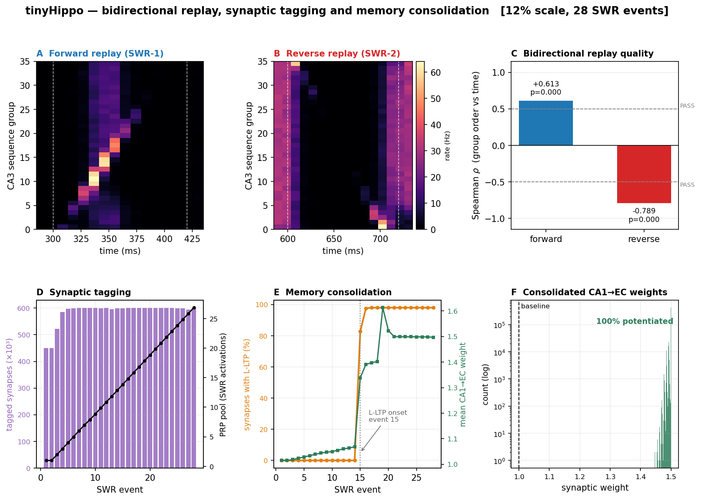

# tinyHippo — results summary

A bio-plausible spiking model of the rat hippocampus (NEST 3.9, Izhikevich
neurons) demonstrating **memory consolidation through bidirectional replay and
sharp-wave ripples** across the full entorhinal–hippocampal loop.

```
EC LII → DG → CA3 → CA1 → EC LII/LV → mPFC
   ↑                            │
   └────────────────────────────┘
```

Scales 1 % → 100 % of the rat hippocampus from one code path
([`replay_scaled.py`](replay_scaled.py)); 12 % ≈ 101 k neurons on MareNostrum 5.



---

## 1. Bidirectional replay

Forward and reverse sequence replay during SWRs, scored as Spearman ρ between
CA3 sequence-group index and mean spike time.

| scale | ρ forward | ρ reverse |
|---|---|---|
| 12 % (+ real DG, consolidating) | **+0.613** (p<0.001) | **−0.789** (p<0.001) |
| 1 % full stack | +0.782 (p=0.008) | −0.794 (p=0.006) |

Both directions pass the ±0.5 criterion **while consolidation is running** —
the two are not in tension.

> **Correction to an earlier conclusion.** Reverse replay previously appeared
> incompatible with consolidation (ρ_rev ≈ −0.03). That was a scoring-window
> artifact: `replay_score()` was called with `(swr_start−5, swr_stop+30)`, and
> the +30 ms tail reaches into the post-SWR rebound where the strong forward
> chain re-ignites a *forward*-propagating burst. That rebound shares the
> forward ordering (so forward was unaffected) but cancels the reverse ordering.
> Re-scoring the archived runs on the SWR window itself recovers reverse replay
> everywhere, including runs from months earlier:
>
> | run | ρ_rev padded | ρ_rev SWR-window |
> |---|---|---|
> | 12 % STC (May) | −0.035 | −0.437 |
> | 25 % STC+LV+mPFC (May) | −0.033 | −0.512 |
> | 12 % + DG (Aug) | −0.094 | **−0.789** |
>
> ρ_fwd is essentially unchanged (+0.622 → +0.613), confirming a one-sided
> distortion. Fixed at all three call sites.

## 2. Synaptic tagging and capture

CA1→EC LII synapses carry STDP-derived tags; a per-EC-neuron PRP pool
accumulates one unit per SWR activation; L-LTP is captured where PRP crosses
threshold **and** a tag is still alive (Frey & Morris 1997).

At 12 %, 28 SWR events: tagging is immediate, the PRP pool builds linearly, and
L-LTP stays at zero until **event 15**, then rises sharply to **98 %** of the
612 k CA1→EC synapses. Mean weight 1.01 → 1.50. The threshold-then-jump shape
is the tag-and-capture signature, not gradual drift.

## 3. Memory consolidation

Consolidation is driven by replay: EC LII fires during SWRs, the PRP pool
builds, and tagged synapses are captured into L-LTP. With the real DG in the
loop the full cortical stack is active (EC LII 6.1 Hz, EC LV 13.0 Hz, mPFC
5.7 Hz) and the consolidation curve matches the pre-DG reference (600 250 vs
600 247 L-LTP synapses).

**Replay ⊥ consolidation.** Blocking L-LTP capture (`--prp-threshold 999`)
leaves replay quality identical (Δρ_fwd = 0.000) while cortical consolidation
goes to zero — the two mechanisms are dissociable in the same model
([`figures/final_comparison_fig9.png`](figures/final_comparison_fig9.png)).

## 4. Dentate gyrus — pattern separation

Real granule cells, two mossy-cell classes and basket feedback replace the
former Poisson proxy; CA3 is driven through mossy-fibre detonator synapses
(low in-degree, high weight).

- Granule active fraction **2.1 % per SWR window** at 12 % (target 2–4 %).
- MC_HIGH / MC_LOW DC-rheobase ratio **4.97×** vs the 5.0× Kassab & Alexandre
  target, confirmed on MN5 (`I_e = −15.1`; the original −9.0 gave only 3.25×).

Rheobase must be measured by **DC current injection**, not Poisson drive: at
weight 20.0 a single EPSP equals the granule cell's entire 20 mV
rest→threshold gap, so the cell relays rather than integrates.

## 5. CA3 — pattern completion

A partial cue of a stored assembly is restored by the recurrent collaterals.


| cue | intact | ablated (`sup_local=0`) |
|---|---|---|
| 10 % | 0.01 | 0.00 |
| 30 % | 0.50 | 0.00 |
| 50 % | 0.92 | 0.00 |
| 70 % | 1.00 | 0.00 |

Sharp attractor threshold ≈ 30 % cue; the ablated control is flat at zero with
cue recall still 1.0, proving the collaterals — not the cue — do the work
(Marr 1971; Nakazawa et al. 2002). The probe needs CA3 primed to a
sharp-wave-like state and a local E/I rebalance; the replay-tuned CA3 is
inhibition-dominated and is not an autonomous attractor without it.

---

## 6. Cortical association build-up (EC LV → mPFC)

A replay-gated Hebbian hook potentiates EC LV→mPFC synapses when an SWR
co-activates both ends, with weak heterosynaptic depression when the target
fires without the source. mPFC also has a k-winners-take-all interneuron loop
(pyramidal → FS → pyramidal), mirroring the DG.

**The association builds, but it is not yet an engram.** Weights grow steadily
(1.00 → 1.10 over 12 replay events at 1 %), but every synapse moves together:
the final weight distribution has a **single unique value**, CV = 0.0000.

The cause is upstream of mPFC, so lateral inhibition cannot fix it. EC LV fires
**all-or-nothing** per SWR window — 600/600 cells or 0/600 — so every mPFC cell
receives identical drive and the winners-take-all loop has no differences to
amplify. mPFC correspondingly fires 120/120 or 0/120. A genuine engram needs
pattern-specific activity to survive the CA1→EC→mPFC path so that different
replayed sequences recruit different cortical subsets.

> An earlier version of this section reported "37.5 % of synapses associated"
> as evidence of a selective engram. That was wrong: `frac_associated` compares
> uniform weights against a threshold that moves with event count, so it can
> report an apparent fraction while every synapse is identical. Weight CV is
> the honest test and is now what the report and HDF5 record.

## 7. Pattern discrimination — why the engram needs a temporal code

An engram is only meaningful with more than one thing to remember: "selective"
means selective for A rather than B. `--n-patterns P` splits the CA3 sequence
groups into P interleaved assemblies, each replayed in its own epochs, making
downstream selectivity measurable for the first time.

**Cortex does not discriminate the patterns.** Jaccard overlap of the active-cell
set, within-pattern (same pattern, different epochs) vs between-pattern:

| population | active | within | between | separation |
|---|---|---|---|---|
| CA3 SUP | 98.3 % | 0.968 | 0.967 | 0.001 |
| CA1 PYR | 49.3 % | 0.290 | 0.288 | 0.002 |
| EC LII | 46.9 % | 0.145 | 0.202 | −0.057 |
| EC LV | 71.0 % | 0.507 | 0.478 | 0.028 |
| mPFC | 86.1 % | 0.117 | 0.226 | −0.110 |

**But the patterns are strongly encoded in CA3 — in spike timing.** Correlating
the per-group *activation-time* profile across epochs, versus the per-group
*active-cell-count* profile:

| code | within | between | separation |
|---|---|---|---|
| **timing** (when each group fires) | **+0.954** | **−0.114** | **+1.069** |
| identity (how many cells fire) | +0.745 | +0.242 | +0.503 |

Timing discriminates the two patterns almost perfectly and ~2× better than
identity. The same conclusion follows from the replay score itself, which is a
timing measure (ρ = +0.72 / −0.55) and works fine.

So the information is present and temporal; what loses it is the readout. Every
projection in the model uses a **single scalar delay** (`d_fast=1.5`,
`d_slow=3.0`, `delay_ca1_ec=3.0`, `delay_lv_mpfc=8.0`), so all spikes arrive
simultaneously and timing carries nothing downstream — and the association hook
is a window-coincidence rule, which is blind to timing by construction.

This is the empirical case for a **polychronization**-style temporal code
(Izhikevich 2006): per-synapse delay heterogeneity plus STDP, so that a
polychronous group — a directed graph of (neuron, delay) edges — becomes the
carrier of pattern identity. It also motivates the cheaper complement: sparser,
more topographic Schaffer connectivity so identity survives CA3→CA1.

## 8. Phase C step 1 — delay heterogeneity alone is not sufficient

`--delay-jitter MS` gives each synapse on the feedforward readout projections
(Schaffer, CA1→EC LII/LV, EC LII→LV, EC LV→mPFC) its own delay, drawn uniformly
around the projection's base value. The CA3 sequence chain and EC LV→CA3
feedback stay scalar: those delays are load-bearing for replay *generation*, so
jittering them would perturb the thing being measured.

Controlled test at 1 %, 2 patterns × 4 replays (12 within-pattern pairs).
`--delay-jitter-wcomp` scales the jittered weights, because spreading arrival
times reduces coincident summation and lowers downstream rates — a confound
that has to be controlled rather than ignored.

| condition | CA3 | CA1 | EC LII | EC LV | mPFC |
|---|---|---|---|---|---|
| base, jitter 0 | **+0.200** | −0.057 | −0.033 | +0.052 | −0.037 |
| jitter 4 ms, w×1.0 | **+0.210** | +0.032 | −0.024 | −0.060 | — |
| jitter 4 ms, w×1.5 | **+0.206** | +0.001 | +0.025 | −0.014 | +0.032 |

(timing separation = within-pattern minus between-pattern correlation)

CA3 is unchanged across all three (+0.200 / +0.210 / +0.206), confirming the
manipulation is correctly targeted — replay generation is untouched. But no
condition produces downstream discrimination: every cortical value sits in
±0.06, i.e. noise.

The rate confound is **bracketed** rather than exactly matched: w×1.0 leaves
cortex at 87–89 % of baseline and w×1.5 overshoots to 128–163 %. Since the two
straddle 100 % and neither shows the effect, the negative result holds across a
±60 % range of cortical firing rate and is not a rate artifact.

This is the expected outcome from polychronization theory: in Izhikevich (2006)
it is **STDP that selects delay-matched paths**. Heterogeneous delays are the
substrate; without a mechanism that potentiates the delay-matched combinations,
jitter only smears arrival times. Delays are necessary but not sufficient —
so the informative next experiment is delays **plus** STDP, not delays alone.

## 9. Phase C step 2 — delay-aware STDP: **does not replicate**

Pair-based STDP on the Schaffer collateral using each synapse's **own** delay,
`dt = (t_post − t_pre) − delay_ij` — the polychronous selection rule, applied at
CA3→CA1 because that is where the signal still exists.

The **mechanism** demonstrably operates: Schaffer weight **CV rises
0.0008 → 0.0388** over 16 replay events, so synapses differentiate rather than
drift together.

A first run showed EC LV timing separation **+0.120**, surviving two static
controls that bracketed (and exceeded) its firing rates. That looked like a
controlled positive. **It does not survive replication.**

Three independent seeds (`--seed` sets both the NEST kernel RNG and the numpy
RNG; varying only one leaves runs partially identical):

| run | CA3 | CA1 | EC LII | EC LV | mPFC |
|---|---|---|---|---|---|
| original | 0.143 | 0.025 | 0.067 | **+0.120** | 0.048 |
| seed 101 | 0.159 | 0.021 | 0.012 | −0.037 | −0.035 |
| seed 202 | 0.171 | 0.018 | **0.556** | −0.029 | −0.002 |
| seed 303 | 0.195 | 0.046 | **0.135** | −0.006 | 0.042 |

EC LV across the three new seeds: mean **−0.024**, sd 0.016. The original
+0.120 sits ~9 sd above that — an outlier, not an effect.

Two further signs it is noise rather than signal:

- The population that "discriminates" **flips between runs**: CA3+EC LV, then
  CA3 only, then CA3+EC LII twice. A real effect lands on the same population
  each time.
- EC LII swings from 0.012 to 0.556 across seeds — a range no mechanism explains.

What *is* robust is the source: **CA3 timing separation 0.167 ± 0.022** across
all four runs. The encoding is real and reproducible; the downstream
transmission is not.

**Conclusion.** Delay heterogeneity alone does not carry the timing code to
cortex (§8), and delay-aware Schaffer STDP does not either. Polychronization
remains a plausible route — the substrate and the selection mechanism are now
both implemented and the mechanism verifiably runs — but at this scale, epoch
count and connectivity it produces no reproducible cortical discrimination.
Candidate next factors: far longer training (Izhikevich ran ~24 h simulated for
polychronous groups to form; these runs are 8 s), recurrent rather than
feedforward cortical targets, and larger populations.

## 10. Cortical sparsity, and a first readable Test 3 (PRELIMINARY)

Test 3 (hippocampal lesion -> cortical recall) was previously unaskable: mPFC
fired 120/120 cells, so there was no assembly to cue, and cortex had no
recurrent excitation to complete a pattern with. Three fixes, in order:

**Sparsity.** Cortical volleys were suprathreshold (CA1->EC LII at 2.5x), so
every cell fired ~1.5 ms before feedback inhibition could arbitrate. Rescaling
each stage to just below threshold AND adding `I_e` heterogeneity gives graded
recruitment. Both were needed: subthreshold volleys with uniform `I_e` fired
nobody, and `V_m` heterogeneity alone did nothing — every initial potential
relaxes to the same rest (−70), so V_m spread is a transient, not a standing
excitability difference.

| population | before | after |
|---|---|---|
| EC LII | 87.3 % | **9.5 %** |
| EC LV | 99.9 % | **62.5 %** |
| mPFC | 100 % | **9.8 %** |
| mPFC assembly | 120/120 | **23/120** |

**E/I balance.** mPFC interneurons were at 0.00 Hz, so the winners-take-all loop
was inert and halving its weight was a no-op (2.0 % -> 2.3 %). mPFC was
excitation-starved; raising EC LV->mPFC brought it to 9.8 % with `mpfc_int` at
0.29 Hz.

**Post-lesion priming.** After the lesion mPFC has no input at all, so the test
otherwise asks cortex to self-ignite from silence. A subthreshold tonic drive
holds cells near threshold; the pre-cue baseline is the guard that it is not
firing them itself.

Result at 1 %, 40 % cue of a 23-cell assembly, hippocampus lesioned:

| condition | completion | baseline |
|---|---|---|
| consolidated (plasticity on) | **0.214** | 0.000 |
| control (no plasticity) | 0.071 | 0.000 |
| priming 60 Hz (too weak) | 0.000 | 0.000 |

Directionally this is what systems consolidation predicts — 3x more recall when
the recurrent weights were shaped by replay, against a proper unconsolidated
control and a zero baseline.

**It is not yet evidence.** Those fractions are **3 cells versus 1 cell**, from a
single seed. Poisson noise on counts that small is comparable to the effect, and
this is the same profile as the EC LV result in §9 that failed to replicate
across three seeds. Cortex also still shows no pattern discrimination by
identity, so even a solid positive would show *an* assembly reactivating rather
than *a specific memory* transferring.

Settling it needs 12 % scale, where mPFC is 1440 cells and an assembly ~250, so
recovered counts are ~30 vs ~10 — measurable rather than anecdotal — plus
several seeds.

## 11. The sparsity retune at 12 % — consolidation becomes selective (Job F)

The cortical sparsity retune of §10 changed EC LII/LV and mPFC weights, `I_e`
heterogeneity and E/I balance, and had only ever been run at 1 %. Job F
(`res/2026-08-17/`, `SCALE=12 DG=1 N_PATTERNS=2 N_SWR=14`) is the sanity run at
12 %. The core holds:

| | pre-retune (08-05) | post-retune (08-17) |
|---|---|---|
| replay ρ_fwd / ρ_rev | +0.70 / −0.54 | **+0.63 / −0.66** (both p<0.001) |
| DG granule active per window | 2.16 % | 1.55 % fwd, 1.60 % rev |
| CA1 PYR | ~5 Hz | 4.82 Hz |
| mPFC | 5.73 Hz (302 Hz in 08-07) | **1.19 Hz** |
| EC LII | 6.12 Hz, 12005/12005 firing | 0.40 Hz, 1847/12005 firing |
| L-LTP | 98.0 % of synapses | **7.0 %** |

The L-LTP drop looks like a regression and is the opposite. In the dense regime
*every* EC cell fired in *every* SWR window, so the PRP pool was just an event
counter — `prp_mean` tracked the event index exactly, everything crossed the
threshold of 14 together at event 14, and the final weights had CV 0.003 pinned
at the ceiling. That is the same non-selective saturation that produced the
retracted "engram" claim, seen from the consolidation side.

With a sparse cortex only ~9 % of EC cells fire per window, PRP accumulates at
0.075/event on average, and the cells that cross are the ones that reliably
participate:

```
                consolidated (862 cells)   rest (11,143)
  final PRP           24.0                     0.0        threshold 14
  weight               0.486                   0.305      1.59x
```

862 of 12 005 EC cells (7.2 %) end up consolidated, weight CV 0.170 spread over
0.29–0.74 — a differentiated trace rather than a saturated one. Consolidation is
also **all-or-none per postsynaptic cell**: consolidated cells have ~49.9 of
their ~51 incoming synapses captured. That is what STC predicts, since the PRP
pool is somatic — and it is a property the dense regime could not have revealed.

So the sparsity retune did not cost consolidation; it made consolidation
selective. Whether that 7.2 % assembly is *pattern*-selective is Test 3, which
has not yet run at 12 % (see below).

### Job D timed out — in the lesion, not the simulation

Job D (Test 3 consolidated) hit the 20 h limit, so Job E was never started. The
simulation was not the problem: all 16 epochs finished in **10 758 s (3.0 h)**,
close to the estimate. It then spent >9 h inside `lesion_hippocampus()`, which
called `nest.GetConnections(source=CA1, target=EC)`. Filtering on `source` makes
NEST scan the entire kernel connection table — ~19 M synapses at 12 % once the
Schaffer STDP set exists. `build_ec_lii()` and `build_stc_hook()` both carry
comments warning about exactly this; the lesion path was written later and
missed it.

Fixed by reusing the connection handles the STC hook already fetched (cost zero)
and falling back to `GetConnections(target=)` with numpy source-filtering, which
touches only that population's incoming slots. No parameter changes are needed —
the run fits comfortably in 20 h once the scan is gone.

## 12. Test 3 at 12 % — cortical recall does not survive the lesion (Jobs D + E)

`res/2026-08-19/`, seed 101, 16 epochs, `SCHAFFER_K=200`, `DELAY_JITTER=4.0`.
Both jobs completed: the lesion that consumed >9 h in the previous attempt now
runs from cached handles, and the post-lesion probe window is present in both
outputs. The hippocampal side is bit-identical across D and E (ρ +0.632/−0.656,
L-LTP 10.1 %, DG 1.52 %), as it must be — `NO_MPFC_ASSOC` touches only the
cortical hook — so the comparison is properly controlled.

Recall reconstructed from the saved mPFC spikes (cue at 16 200 ms, 80 ms
scoring window, 40 % of the assembly cued, baseline 16 100–16 180 ms):

| | assembly | uncued | cue_recall | completion | baseline | net |
|---|---|---|---|---|---|---|
| D consolidated | 309 | 185 | 0.992 | 0.049 (9 cells) | 0.022 (4) | **+0.027** |
| E control | 303 | 182 | 1.000 | 0.016 (3 cells) | 0.005 (1) | **+0.011** |

**This is a negative result.** The `[OK]` criterion is 0.25, which at this
assembly size means ~46 of 185 uncued cells; D reactivated 9. Both runs miss it
by roughly an order of magnitude, so the gap is not a matter of statistical
power — cortex does not reconstruct the pattern once the hippocampus is cut.

D is directionally above E, 3x on the raw counts, matching the direction of the
1 % preliminary in §10. It does not survive testing: Fisher exact on 9/185 vs
3/182 gives **p = 0.140**, from a single seed. This is the same profile as the
EC LV effect in §9 that failed to replicate across three seeds, and it should
not be reported as an effect. D against its own pre-cue baseline is p = 0.020,
but that is 9 cells against an expected 4.

**Correction.** An earlier version of this section read the mechanism off the
HDF5 `mpfc_assoc` group, reporting that "the mPFC recurrent hook barely moved —
614 of 28 800 synapses at ceiling". That group is the **feedforward EC LV→mPFC**
projection (`K_eclv_mpfc` 20, `w_init` 1.8), not the recurrent one. The
recurrent hook runs but its weights were never written to the file, so those
numbers said nothing about the cortical attractor. The recurrent weights are now
exported as a separate `mpfc_recurrent` group. The Test 3 verdict above is
unaffected — it is computed from spikes.

What can be said without those weights is structural, and it is enough. The
recurrent projection is `K_rec = 20` random inputs per cell over N = 1440, so an
uncued assembly cell receives on average

    20 x 124/1440 = 1.72

inputs from the 124-cell cue. At the initial `w_rec` 0.9 that is ~1.5 mV against
a ~20 mV rest→threshold gap; even pinning every one of those synapses at a 2.4
ceiling reaches only ~4.1 mV. **Test 3 cannot pass at `K_rec = 20` however well
the learning works** — clearing threshold needs ~8 ceiling-weight inputs from
the cue, i.e. `K_rec` ≳ 97, and that already assumes synchronous arrival, which
does not hold (§10). Note this is the same `K x w` reasoning that misled the E/I
iteration, so treat it as an order-of-magnitude bound, not a prediction.

E/I balance is **not** the lever, despite the analogy to CA3 in §5. During the
post-cue window mPFC interneurons fire 6 of 288 cells at 0.26 Hz — there is
almost no inhibition to rebalance, the same trap that made an earlier attempt to
halve mPFC inhibition a no-op.

So the honest state of the loop: replay, separation, completion, tagging and
selective consolidation all work at 12 %, and the trace reaches cortex as
weights — but it is not yet strong enough to be *read out* without the
hippocampus, which is what systems consolidation requires.

## 13. Do we have engrams? No — and that is the root problem

Scored against the standard criteria (Josselyn & Tonegawa 2020):

| criterion | status |
|---|---|
| sparse | yes — 862/12 005 EC cells consolidate, all-or-none per cell (§11) |
| persistent | yes — L-LTP captured, 1.59x weights |
| **specific** | **no** |
| sufficient | no — Test 3, 0.049 vs a 0.25 criterion (§12) |
| necessary | never tested |

Specificity is the definitional core of an engram, and at 12 % it is not weak,
it is absent. Within-pattern vs between-pattern separation, Job F (14 epochs,
2 patterns alternating):

| population | active | identity sep | timing sep |
|---|---|---|---|
| CA3 SUP | 98.0 % | 0.000 | 0.028 |
| CA1 PYR | 100.0 % | −0.003 | 0.002 |
| EC LII | 18.4 % | +0.055 | −0.027 |
| EC LV | 83.8 % | +0.013 | −0.009 |
| mPFC | 72.6 % | +0.036 | +0.058 |

Nothing anywhere distinguishes pattern A from pattern B.

### Where it is lost: DG is sparse but not selective

§4 reports DG "pattern separation" as an active fraction of 2–4 %. That
measures sparseness only. Selectivity is a different claim, and it fails:

```
DG granule   3.28% active   Jaccard within 0.067   between 0.067   sep +0.000
CA3 SUP     98.0% active    Jaccard within 0.961   between 0.960   sep +0.000
```

0.067 is 4x chance overlap (chance = f/(2−f) = 0.017 at f = 3.28 %), so granule
activity is weakly reproducible — but within-pattern equals between-pattern to
three decimals. Restricting to the 7 epochs that replay the *same* pattern:

```
cells active at least once   14,124   (5.8x the 2,442 active in any one window)
fired in 1/7 windows         11,671   (83%)
fired in 7/7 windows              0
fired in >=6/7                    1
```

There is no core assembly. The same pattern recruits a nearly-disjoint granule
population on every replay. Counts 2–6 do exceed the binomial null (2,019 vs
798; 363 vs 23), so per-cell excitability biases the draw, but noise dominates.

### Why: the pattern-carrying input is 0.6 % of granule drive

Granule cells receive two excitatory sources — the EC LII perforant path, which
carries the replayed pattern, and a heterogeneous Poisson residual standing in
for unmodelled cortex, **resampled independently every window**. Per cell:

| source | mV/s | share |
|---|---|---|
| Poisson residual (noise) | 494.0 | 99.4 % |
| EC LII perforant path (signal) | 3.0 | **0.6 %** |

DG cannot be pattern-specific when 99.4 % of its drive is fresh noise. The
granule code is decided by Poisson shot noise, which is exactly the
participation statistics above.

Two compounding causes. First, `build_dg_module`'s budget comment assumes EC LII
fires at ~3 Hz (`EC 50 * ~3 Hz * 0.15 = 23`); after the §11 cortical sparsity
retune it fires at **0.40 Hz**, so the term is 3.0, not 23 — the retune cut the
signal share from ~4.4 % to 0.6 % without anyone noticing. Second, even the
design point was never enough to build a reproducible assembly.

This is not a parameter tweak, because the two drives are limited by different
things. EC arrives **synchronously** in SWR-locked bursts, so `K x w_ec_dg` must
stay under the 20 mV granule gap or every granule cell detonates (measured:
`K=50 w=0.4` saturates DG to 98.8 % by the second SWR). The Poisson residual
arrives **asynchronously**, so it dominates the mean-rate budget while staying
individually subthreshold. Raising the signal hits the synchrony ceiling long
before it wins the rate competition, and removing the noise reintroduces the
cold-start deadlock the residual exists to solve — DG has no drive until the
loop runs, and the loop cannot start without DG.

### Consequence for Test 3

A cortex that completes a pattern it cannot distinguish from any other pattern
is an attractor, not a memory. Any positive Test 3 obtained while §13 stands
demonstrates that mPFC has recurrent dynamics, **not** that a specific memory
became hippocampus-independent. Specificity has to be settled first; the
`K_rec` work in §12 is downstream of it.

## 14. Six more attempts at DG selectivity — all negative, one real bug found

§13 named the residual Poisson drive as the reason DG cannot be pattern-specific
and described it as "resampled independently every window." That is true of the
generator's *spike output* — a Poisson process, of course, fires different
timestamps each window — but not of its *rate parameter*: `build_dg_module`
draws each granule cell's residual rate **once**, at build time, and never
touches it again. A cell that happens to draw a high rate is the loudest cell
in every window for the rest of the run, which looks like independent
resampling in a raster plot but is not. This section documents finding and
partially fixing that gap, and five follow-on interventions that did not
restore selectivity.

### Neurogenesis, twice, both negative

Phase 8 (age-indexed intrinsic properties: young cells more excitable, less
inhibited, no learning) and Phase 10 (real Hebbian EC LII→GC plasticity,
restricted to neurogenesis cohorts after the full-population version proved
computationally infeasible — its one-time synapse cache cost 14–16 h of a 20 h
MN5 budget) were both tested as candidate DG selectivity mechanisms this
session, on the theory that a cohort tuned by recent experience could respond
differently to a held-back "oddball" pattern than to a familiar one. Neither
moved DG off chance, at 12 % scale, MN5, matched seed:

| condition | DG active | DG identity sep | DG timing sep |
|---|---|---|---|
| no neurogenesis (control) | 4.4 % | +0.001 | −0.002 |
| age-indexed neurogenesis (Phase 8) | 4.4 % | −0.023 | +0.009 |
| neurogenesis + cohort Hebbian learning (Phase 10) | 4.4 % | −0.023 | +0.003 |

An epoch-resolved oddball comparison (novel pattern C's active set vs. every
other pattern's, epoch by epoch) found no pattern-identity signature in either
condition — only a same-cells-recur-nearby-in-time artifact under
neurogenesis, consistent with §13's "no core assembly" finding, not with
novelty detection.

### The residual-rate bug, and what it actually costs

Two MN5 runs with different `--seed` shared 66 % of DG's "always-on" cells
(active in ≥8/14 epochs) — 632 cells in common against ~8 expected by chance.
Two independent causes, both silent regardless of `--seed`:

1. `build_dg_module`'s residual Poisson rate is drawn once, never refreshed
   (this section's headline finding).
2. `build_dg_module`'s own `seed_connect` defaulted to `42` unconditionally —
   the call site never threaded `--seed` through, so every run drew the
   *identical* granule V_m/rate heterogeneity regardless of seed.

Fix: re-randomize the residual rate every epoch
(`run_dg_residual_refresh_hook`, and the equivalent for each neurogenesis
cohort's own residual generator), and thread `--seed` into `seed_connect`.
Verified locally (1 % scale, matched seed, `--het 0.30`, 14 epochs):

| | before fix | after fix |
|---|---|---|
| cells active ≥8/14 epochs | (not measured at 1 % pre-fix) | 565 (expected ~4 by chance) |
| cells active in all 14 epochs | — | 10 (expected ~0) |

565 vs. 4 says the fix did not fully work with heterogeneity on. Repeating
with `--het 0` (no per-cell neuron-parameter draw) eliminated the excess
completely — 0 cells at every threshold, exactly matching chance. So a
**second**, independent source of persistent per-cell bias exists:
`--het`'s one-time `a/b/c/d/I_e` draw (30 % CV) is itself enough to rank
granule cells by fixed excitability for the whole run, and it was not touched
by this fix. This is not a bug — the heterogeneity is deliberate, tuned
elsewhere for realism and robustness (§8–9) — but it has the same practical
effect on DG as the residual-rate bug did.

Even with the stereotypy fully eliminated (`--het 0`), DG identity separation
was **still 0.000**. Removing the bias was necessary but not sufficient: a
fair, per-epoch-independent competition is still a competition decided by
noise, not by which EC LII cells are currently active, unless the signal is
actually strong enough to win it. That is the same 0.6 %-of-drive problem
§13 already named — the residual-rate bug just added a second, deterministic
distortion on top of it.

### Two attempts to shift the SNR, both negative

With the fix in place and `--het 0.30` restored (the tuned config, not
touched), two follow-up interventions tried to give EC LII's signal more
relative weight without disturbing §13's synchrony-ceiling constraint:

| config | DG active | DG identity sep | EC LII discriminates? |
|---|---|---|---|
| baseline (`w_ec_dg=0.6`, `pp_residual=0.9`) | 15.1 %† | −0.009 | timing only |
| `w_ec_dg=1.0` | **46.0 %** | −0.047 | none |
| `pp_residual=0.5` | 16.1 % | −0.007 | none |

† 1 % scale; not comparable to the 12 % 2–4 % target — see caveat below.

`w_ec_dg=1.0` reproduces exactly the failure mode §13 predicted: `K x w` is
close enough to the 20 mV granule gap that the closed EC→DG→CA3→CA1→EC loop
detonates, active fraction runs to 46 %, and EC LII's own established timing
signal is destroyed along with it — strengthening the signal broke the one
thing that was working. Cutting `pp_residual` to shrink the noise floor
instead left DG's active fraction essentially unchanged (15.1 % → 16.1 %),
which suggests the basket-mediated feedback loop clamps the active fraction
by *rate*, largely independent of the residual's amplitude — so shrinking the
residual did not shift the competition toward EC LII the way a simple
signal-vs-noise picture predicts, and it cost the one significant result
(EC LII's timing separation dropped out of significance). Both directions
tried; both failed; the second was actively regressive.

### Analysis: why the system sits here

- **The competition may not be input-selective at all.** Basket feedback
  keeps the active *fraction* in a narrow band, but nothing in its design
  targets which cells specifically fire — it looks like a rate clamp, not a
  content-addressable winner-take-all. `pp_residual=0.5`'s null result (active
  fraction barely moved) is consistent with this: the clamp defends a target
  rate, not a target identity.
- **Two competing, both-deliberate design goals are in tension.** `--het`
  heterogeneity is tuned for realism and robustness elsewhere in the model;
  DG pattern separation needs granule cells to be interchangeable enough that
  input, not fixed identity, decides who wins. Nothing in this session
  reconciles the two — they were tested as alternatives, not combined.
  A DG-scoped heterogeneity toggle (leave CA3/CA1 untouched) is untried.
- **The loop-gain ceiling caps how much signal-boosting is even safe to try.**
  Because EC LII→DG→CA3→CA1→EC LII/EC LV is a closed loop, any static
  increase to the DG-stage gain (`w_ec_dg`) risks amplifying around the whole
  loop, not just at DG — as observed. Any future signal-boosting attempt
  needs to raise EC LII's *effective* pattern-locked drive without raising
  its *loop* gain, e.g. sharpening EC LII's own place-field tuning, or timing
  the perforant-path kick more precisely into the SWR window, rather than
  scaling `w_ec_dg` further.
- **1 % scale is not a clean stand-in for 12 %.** `K_pp=50` is fixed
  regardless of `--scale`, so a granule cell's 50 perforant-path samples cover
  5 % of EC LII's pool at 1 % scale (1,000 cells) vs. 0.4 % at 12 % (12,005
  cells) — a very different effective sampling regime. All four bracket runs
  in this section ran at 1 % scale for turnaround speed; the residual-rate
  fix itself is scale-independent (it is about *when* a rate is drawn, not
  how many cells there are), but the two SNR-tuning results should be treated
  as hypotheses to re-check at 12 %, not confirmed at the scale that matters.

## Open items

- **Cortical selectivity is unsolved.** Pattern identity is robustly encoded in
  CA3 spike timing (0.167 ± 0.022) but does not reach cortex. Neither delay
  heterogeneity (§8) nor delay-aware Schaffer STDP (§9) transmits it; the one
  apparent positive failed to replicate across three seeds. Untested factors:
  much longer training, recurrent cortical targets, larger scale.
- **Ripple background is still epoch-0 only.** The replay drive (trigger +
  staggered scaffold) now repeats every epoch, so epochs 1…*n*−1 do contain
  real replay. The sharp-wave/ripple *background* does not: repeating it needs
  ~16 k `sinusoidal_poisson_generator`s per window (one per neuron across
  CA3+CA1), and NEST steps every generator at every timestep regardless of its
  start/stop — at 6 epochs that is ~211 k generators and a 1 % run had not
  finished after 3 h. Doing it cheaply needs
  `inhomogeneous_poisson_generator` (one node, scheduled rate profile).
- **EC LII→DG loop gain** is set by synchrony, not mean rate: EC fires in
  SWR-locked bursts, so K·w must stay well under the 20 mV granule
  rest→threshold gap or the loop saturates DG. Confirmed again in §14
  (`w_ec_dg=1.0` → 46 % active, detonation) — the ceiling is real at both
  scales tried.
- **DG selectivity remains unsolved after six independent attempts** (§13–14):
  age-indexed neurogenesis, cohort Hebbian learning, the residual-rate fix,
  heterogeneity off, and both SNR-tuning directions. Identity separation has
  not moved off ~0.000 under any of them. Untried: a DG-scoped heterogeneity
  toggle (leave CA3/CA1 untouched), sharpening EC LII's own pattern-locked
  drive instead of scaling `w_ec_dg`, and re-running the two SNR brackets at
  12 % rather than 1 % (see §14's scale caveat).

## Reproducing

```bash
# 1% test: replay + DG, ~1 min
python replay_scaled.py --scale 1 --dg --dg-scale 2 --no-figures

# full stack with consolidation
python replay_scaled.py --scale 1 --dg --ec-lii --stc --ec-lv --mpfc --n-swr 6

# CA3 pattern completion (intact vs ablated)
python replay_scaled.py --scale 1 --pattern-completion

# figures from any output
python plot_consolidation_figure.py --in <file.h5>
python plot_pattern_completion.py  --in <pattern_completion.h5>
```

On MareNostrum 5 (see [`run.sh`](run.sh)):

```bash
sbatch --export=ALL,SCALE=12,DG=1,N_SWR=14 run.sh
```
