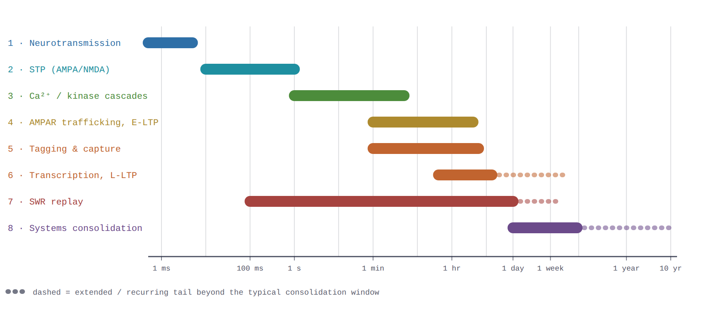

# Hippocampal Timescales as a Circuit Specification

## Why this note exists

Two kinds of material tend to live in separate documents and serve different audiences: the molecular biology of memory consolidation — from a single glutamate release event to a memory trace redistributed across neocortex — and a feasibility case for building the dendritic-processing side of that circuit in memristive/CMOS hardware. Neither, alone, makes the connection explicit: *the biological time constants are not background color, they are the spec the circuit has to hit.* This note exists to make that connection short enough to read in one sitting.

Nothing here replaces the source documents — it is a compressed path through both, keeping only what a circuit or systems designer needs from the biology, and only the feasibility conclusions (not the full derivations) from the hardware analysis.

## 1. The timescales, compressed

Learning in this system runs on eight processes spanning nine orders of magnitude, from a single receptor gating event to a memory trace redistributing across cortex over months. What matters for hardware is not the molecular detail of each stage but three facts: which stages are fast enough to force analog/continuous-time circuitry, which are slow enough that a clocked digital design is free, and where the biological threshold behavior maps directly onto a specific circuit primitive.

*Fig. 1 — All eight consolidation stages on one log time axis. Full molecular detail (receptor subunits, kinase cascades, transcription factors) is in the companion consolidation-timescales document; what carries over to the hardware discussion below is just the numbers.*

| Stage | Time constant | What it forces on a circuit |
|---|---|---|
| Neurotransmission (AMPA/NMDA gating) | ~0.5–5 ms | Sets the fastest timescale in the whole system — the floor for any front-end comparator bandwidth. |
| Short-term plasticity | ~10 ms–1 s | NMDAR's slower deactivation is *why* a ±20 ms coincidence window exists at all — a real biophysical constant, not a modeling convenience. |
| Ca²⁺/kinase cascades | ~1 s–5 min | The "weight update decision" happens on this timescale; anything reading it out only needs to sample in the low-second range. |
| AMPAR trafficking / early-LTP | ~1–30 min, decays over 1–3 hr | A real, decaying analog state — this *is* the tag described below. |
| Synaptic tagging & capture | tag set in 1–2 min, decays τ≈1–4 hr | The pivot point: a local, transient, decaying signal that is either captured or lost — directly analogous to a volatile-memristor relaxation state (§3). |
| Transcription / late-LTP | onset ~30–60 min, stable by ~4–8 hr | Once captured, this state should stop decaying — a discrete regime change, not a continuous process. |
| Sharp-wave-ripple replay | ripple 100–300 ms, recurs over hours–days | Compressed replay packs sequence elements only a few milliseconds apart — this is the number that actually sizes circuit timing budgets in §4. |
| Systems consolidation | days–weeks (rodent) to months–years (human) | Fully clocked-digital territory; no continuous-time requirement whatsoever. |

## 2. The dendritic-convolution pipeline: what's cheap and what's hard in silicon

The companion hardware document frames dendritic processing as a three-stage information-reduction pipeline — a postsynaptic threshold, an OR-gated refractory junction, and a somatic summation — each stage a candidate site for replacing an expensive analog circuit with a cheap thresholding one. Its stage-by-stage feasibility verdict:

| Stage | Circuit primitive | Feasibility | Main open risk |
|---|---|---|---|
| Postsynaptic threshold (dSpike) | Memristor + local comparator | High — prototype-ready | Conductance drift shifting the threshold near the decision boundary |
| Junction (OR + refractory) | Wired-OR + edge-catcher + counter FSM, or a volatile memristor | High | Volatile-memristor relaxation-time variability, if used in place of a digital counter |
| Synaptic clustering | Non-uniform crossbar floorplan / reconfigurable interconnect | Moderate — the binding constraint | Needs 3D memristive/CMOS integration to be biologically faithful; not yet a mature foundry process |
| Somatic E/I summation | Differential integrate-and-fire | High — already standard (Loihi, BrainScaleS, TrueNorth-class cores) | None specific to this proposal |

Three of four stages are close to off-the-shelf. The interesting one — both because it's the hardest and because it's where the biology and the device physics line up most directly — is the junction/tag stage, which is worth its own figure.

## 3. Tag decay and capture: a directly testable hardware analogy

The synaptic tagging-and-capture (STC) mechanism described in the hippocampal plasticity literature has a clean circuit reading: a tag is set by coincident activity, decays with a fixed time constant if nothing happens, and is *captured* — converted to a stable, non-decaying state — only if a separate signal (biologically, a plasticity-related-protein pool) crosses threshold before the tag decays. This is close to the operating description of a **volatile threshold-switching memristor**: a device that transitions to a low-resistance state on a triggering pulse and spontaneously relaxes back over an intrinsic retention time — unless something latches it into a non-volatile state first.

*Fig. 2 — The tag-decay/capture dynamic, and the falsification test it implies. Both traces receive identical STDP-driven jumps per event (replay quality is unaffected either way); they diverge only in whether the tag gets captured before it decays.*

The dashed trace is the predicted signature if capture is blocked entirely: the weight distribution should stay flat while replay quality (measured independently) stays unchanged — a clean separation of the replay mechanism from the consolidation mechanism. That separation is also, functionally, the experiment you'd want to run on a candidate memristive tagging device: drive it with the same input statistics, and check whether blocking "capture" produces the same flat, non-accumulating signature.

## 4. What continuous time actually costs, and where it's needed

Every stage above is realizable in a purely clocked digital design in principle — quantize time, evaluate on ticks, done. What's lost by doing that is concentrated almost entirely in two places: the postsynaptic threshold crossing (a real-valued event time, quantized to within half a tick by any clocked evaluator) and the few-millisecond spacing between elements within a single compressed replay event, which is finer than the 5–10 ms refractory windows typically cited for dendritic spikes and finer than most digital-SNN simulation time steps. Everything downstream of the junction — routing, somatic summation, systems-level consolidation over days to years — tolerates tick-scale quantization without qualitative error, and can stay ordinary clocked digital at negligible cost. The practical design rule this note draws from the fuller analysis: spend continuous-time analog circuitry only at the synapse/dendrite boundary, where the biology's own timing claims live; leave everything else digital.

Two existing figures from the hardware document make the resulting architecture concrete — a single-neuron reference topology showing the threshold/junction/soma pipeline (`th/rp` primitive reused at every level), and a network-level topology showing the same primitive tiled across populations connected by millisecond-scale spike routers:

- [Single-neuron reference topology](https://raw.githubusercontent.com/max-talanov/tinyHippo/refs/heads/main/dendritic_convolution_reference_topology.jpeg)
- [Network-level routing topology](https://raw.githubusercontent.com/max-talanov/tinyHippo/refs/heads/main/network_level_routing_topology.jpeg)

---

*Full technical detail: [Consolidation Cascade](https://claude.ai/code/artifact/f879468e-00e8-4ca1-9acc-348b12cc7e33) (molecular timescales) and `neuron_model_optimization.md` (hardware feasibility).*